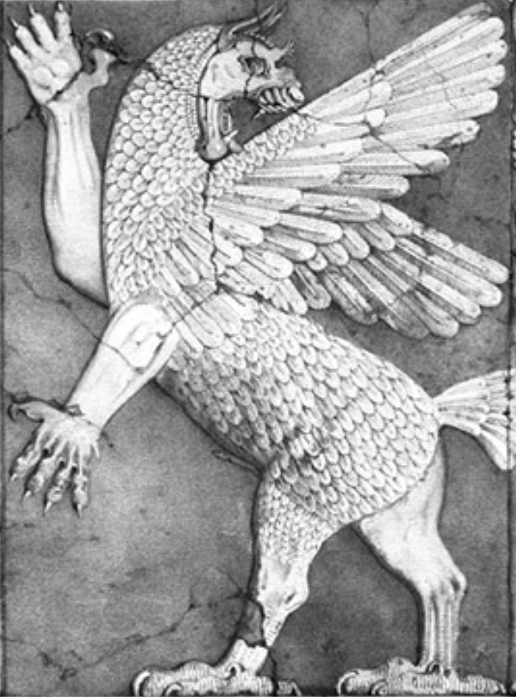

# AnzuETW

	
	
#what is AnzuETW ?

it is a side project that I was working recenlty, the goal is to allow SOC/DFIR teams to create their own plugins.
ETW : it is very powerfull logging tool developed by microsoft but it does not offer any kind of usage to normal SOC team, ETW used heavly by EDRs

this project solve multiple issues inculding the following: 
1. SOC can not take ETW logs due the larg data it generate ,using AnzuETW you can specify exactly what log to be logged using custom plugin you can write in C# 
2. it allow SOC team to create plugins that utlize ETW and log and reponse to the threat that including behavior analysis plugin that can be written by the SOC team 
3. using AnzuETW can provide you logs that normaly you can not get.
4. using AnzuETW can let the SOC team to develop their own plugins responed to specific scenario or new technique not just rule it can be based on behavior.

## projects file

1. Anzu => AnzuETW with console window
2. AnzuService => AnzuETW Service that can run in background same as console version 
3. CortexRansomwareBypassDetectPlugin => custom plugin that I wrote to reponde to custom threat that bypass the ransomware protection developed by cortex using behavior analsyis (this can not be done without Anzu ^_^)
4. LogNetwork => plguin to log network traffic 
5. LogProviderExample => example plugin to log every command line.

you can follow my blog post on how to use AnzuETW, contrbiution is welcome .

[AnzuETW](https://www.pwntricks.com/)

